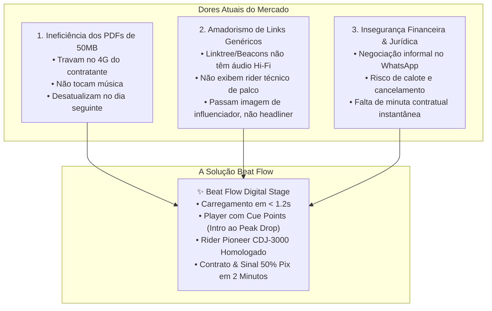
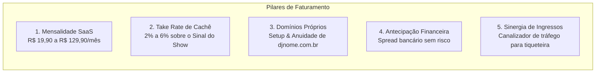
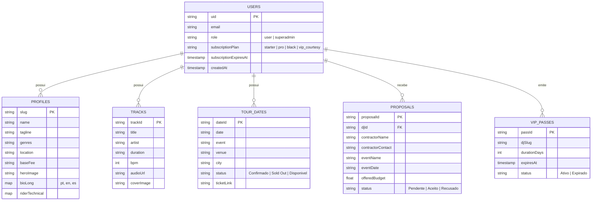

# BEAT FLOW by NEXORA — Dossiê Mestre Técnico e Comercial

> **Documento:** Especificação Técnica de Requisitos (SRS), Escopo de Produto e Plano de Negócios Comercial  
> **Versão:** 2.0 (Produção / Release Comercial)  
> **Classificação:** Documento Executivo, Comercial e de Engenharia de Software  
> **Propriedade Intelectual:** NEXORA Technologies © 2026  

---

# PARTE 1: DOCUMENTO COMERCIAL & PLANO DE NEGÓCIOS (BUSINESS SPECIFICATION)

## 1.1. Visão Executiva & Tese de Mercado
O mercado global de música eletrônica, entretenimento ao vivo e festivais movimenta mais de **US$ 9,2 bilhões ao ano**. No Brasil e na América Latina, a expansão acelerada de clubs conceituais, beach clubs, rooftops, casamentos de alto padrão e festivais gerou uma demanda exponencial por DJs profissionais e produtores musicais.

Contudo, a cadeia de contratação e apresentação artística ainda opera sob modelos arcaicos, fragmentados e altamente ineficientes.

O **BEAT FLOW** surge para redefinir o padrão da indústria, estabelecendo o primeiro **Palco Digital (Digital Stage) & Smart Press Kit (EPK)** que une em uma única URL cinematográfica a identidade sonora do artista, o player de alta fidelidade com salto rápido para o clímax, o rider técnico homologado, a emissão de proposta formal com sinal de 50% via PIX e a integração direta com a venda de ingressos.

---

## 1.2. Mapeamento das Dores Críticas da Indústria (Pain Points)

---

## 1.3. Matriz de Personas & Mapa de Empatia

| Persona | Perfil & Contexto | Principais Dores | Como o Beat Flow Transforma a Vida |
| :--- | :--- | :--- | :--- |
| **DJ Iniciante / Residente de Bar** | Toca semanalmente em bares e eventos locais; cachê de R$ 800 a R$ 2.000. | Falta de material profissional; dificuldade em cobrar cachês mais altos. | O perfil transmite autoridade imediata de artista de festival, permitindo dobrar o valor do cachê. |
| **DJ de Turnê / Headliner de Festival** | Toca em múltiplos estados e clubs conceituais; cachê de R$ 5.000 a R$ 25.000. | Exigências técnicas estritas de cabine; assessoria de imprensa precisa de fotos 4K e logos vetorizados. | EPK em 3 idiomas, fotos 4K em Lightbox, logos PNG transparentes e Rider Técnico de cabine homologado. |
| **Agência de Artistas / Booker** | Gerencia a agenda de 5 a 20 DJs simultaneamente. | Dificuldade em responder propostas rápido; perda de tempo enviando riders manualmente. | Painel multi-artistas unificado com recebimento formal de propostas e split de comissões. |
| **Contratante / Dono de Club** | Produtor de eventos sobrecarregado com centenas de mensagens no WhatsApp. | Não tem tempo de ouvir sets inteiros de 1 hora; precisa saber o rider antes de fechar. | Ouve o clímax da faixa em 1 clique (Peak Drop) e visualiza a compatibilidade de equipamentos na hora. |

---

## 1.4. Modelo de Monetização & Streams de Receita (Os 5 Pilares)

### 1.4.1. Escada de Planos (Tiering Estratégico)
1. **Plano Starter (R$ 19,90/mês ou R$ 179/ano):**
   * Preço de penetração irresistível ("Preço de 1 energético na balada").
   * Perfil oficial completo, Player Hi-Fi, Rider Técnico, Passe Digital NFC e botão de proposta.
2. **Plano Pro Touring (R$ 49,90/mês ou R$ 449/ano) — *O Mais Vendido*:**
   * Inclui **Stage Mode (Modo Telão LED)**, **EPK Multi-Idiomas (PT/EN/ES)**, **Pack de Fotos 4K**, **Analytics de Contratantes** e **Domínio Próprio**.
3. **Plano Black Agency (R$ 129,90/mês ou R$ 1.190/ano):**
   * Gestão de até 10 artistas, suporte prioritário via WhatsApp e selo de verificação oficial Nexora.

---

## 1.5. Unit Economics & Projeção Financeira Detalhada

* **Custo Operacional por DJ:** **R$ 0,35 a R$ 0,95 / mês** (Firebase Serverless, Edge Cache e Storage).
* **Margem Líquida:** **Superior a 85% a 92%**.
* **Ponto de Equilíbrio (Break-Even):** **Apenas 5 DJs pagantes** sustentam 100% dos custos fixos da operação.

| Base de DJs Ativos | Faturamento Mensal SaaS | Receita Estimada em Taxas de Shows | Custos de Infraestrutura | Lucro Líquido Mensal | Lucro Anual Projetado |
| :---: | :---: | :---: | :---: | :---: | :---: |
| **50 DJs** | R$ 1.650,00 | R$ 750,00 | ~R$ 35,00 | **R$ 2.365,00 / mês** | ~R$ 28.300 / ano |
| **200 DJs** | R$ 7.980,00 | R$ 3.800,00 | ~R$ 110,00 | **R$ 11.670,00 / mês** | ~R$ 140.000 / ano |
| **500 DJs** | R$ 21.500,00 | R$ 9.500,00 | ~R$ 260,00 | **R$ 30.740,00 / mês** | ~R$ 368.800 / ano |
| **1.000 DJs** | R$ 44.900,00 | R$ 19.800,00 | ~R$ 520,00 | **R$ 64.180,00 / mês** | ~R$ 770.000 / ano |

---

## 1.6. Estratégia Go-To-Market (GTM) & Crescimento Viral por Convites
* **Acesso VIP Embaixador (30 Dias Cortesia):** O Dono emite cortesias no painel Admin com link único e mensagem formatada para WhatsApp. O DJ experimenta o status da plataforma, coloca o link no Instagram e atrai dezenas de outros DJs organicamente.
* **Efeito Rede (Network Effects):** Cada vez que um DJ divulga sua agenda ou toca em um evento, o público e outros artistas veem a chancela *Beat Flow by NEXORA*.

---

# PARTE 2: ESCOPO DETALHADO DO PROJETO (PROJECT SCOPE)

## 2.1. Declaração de Escopo do Produto
O projeto compreende a entrega e operação contínua de:
1. **Frontend Público Multi-Temas:** Roteamento dinâmico (`app/[slug]/page.tsx`) com 4 presets estéticos paramétricos (`NOIR & CHROME`, `SUNSET & ORGANIC`, `ICE & FUTURISTIC`, `RAW & INDUSTRIAL`).
2. **Landing Page Interativa de Alta Conversão (`app/page.tsx`):** Com simulador 3D de smartphone em tempo real, seletor de temas e ticker de atividade social.
3. **Área Restrita do DJ & Dashboard (`app/dashboard`):** Painel para gerenciamento de perfil, upload de faixas, controle de agenda de turnê e exportação de passes NFC.
4. **Painel Super Admin (`app/admin`):** Módulo de controle do proprietário com emissão de cortesias VIP, monitoramento de usuários e controle de segurança.
5. **Infraestrutura Serverless Custo Zero:** Arquitetura baseada em Next.js 15, React 19, TypeScript, Tailwind CSS, Motion e Firebase (Firestore, Auth, Storage).

## 2.2. Limites do Escopo (Out of Scope)
* **Zero Estoque Físico:** A tecnologia NFC opera 100% digitalmente no smartphone do usuário (Web NFC API e vCard), eliminando custos e logística de cartões físicos.
* **Não-Canibalização de Ingressos:** O Beat Flow não desenvolve um sistema paralelo de bilheteria; ele conecta a agenda do artista diretamente à plataforma de ingressos existente do proprietário.

---

# PARTE 3: ESPECIFICAÇÃO DE REQUISITOS DE SOFTWARE (SRS)

## 3.1. Requisitos Funcionais (RF)

### Módulo 1: Experiência do Palco Digital (`/[slug]`)
* **RF01 (Atmosferas Volumétricas Paramétricas):** O sistema deve renderizar iluminação dinâmica em Canvas de acordo com o preset selecionado (`noir-chrome`, `sunset-organic`, `ice-futuristic`, `raw-industrial`).
* **RF02 (Navegação Espacial Desktop):** O sistema deve fornecer uma barra superior translúcida com abas sincronizadas (`Palco`, `EPK`, `Rider`, `Agenda`, `Booking`) e suporte a atalhos de teclado (`Espaço` = Play/Pause, `S` = Telão LED, `ESC` = Fechar).
* **RF03 (Efeito 3D Parallax Tilt):** Os cards e fotos do artista devem reagir dinamicamente à posição do cursor do mouse.
* **RF04 (Audio Deck com Cue Points):** O player Hi-Fi deve permitir salto imediato para 4 marcadores pré-definidos: `Intro` (0:45), `Build-up` (2:30), `Peak Drop` (4:15) e `Outro` (5:50).
* **RF05 (EPK Multi-Idiomas):** A biografia do artista deve ser apresentada em Português, Inglês e Espanhol com botão de copiar em 1 clique.
* **RF06 (Galeria 4K em Lightbox):** As fotos de imprensa devem abrir em modal de alta resolução com zoom e download individual ou em pacote.
* **RF07 (Logos Vetorizados em Fundo Transparente):** Disponibilização de arquivos em formato PNG/SVG transparente para designers de eventos.
* **RF08 (Rider Técnico Homologado):** Apresentação visual de CDJs 3000, mixer DJM-A9, Input List de canais e rider de camarim.
* **RF09 (Agenda de Shows & Sinergia de Ingressos):** As datas de turnê devem exibir o status do show e o botão oficial `Garantir Ingresso / Lista VIP` com redirecionamento para a tiqueteira parceira.
* **RF10 (Modo Telão LED / Stage Mode):** Visualizador em tela cheia com tipografia monumental e pulsação luminosa para projeção em palcos e clubs.

### Módulo 2: Booking, Contratação & Finanças
* **RF11 (Modal Conversacional de Propostas):** Fluxo guiado em 3 etapas para coleta de dados do contratante, data, cidade, duração do set e orçamento.
* **RF12 (Cálculo de Sinal de 50% via PIX):** Geração automática do valor de entrada para reserva formal de data.
* **RF13 (Disparo Direto para WhatsApp):** Geração de mensagem estruturada e pré-formatada para o WhatsApp oficial do DJ ou Booker.

### Módulo 3: Tecnologias Nativas Mobile & Hardware
* **RF14 (Passe Digital NFC Instantâneo):** Transmissão do perfil para outros celulares por aproximação via Web NFC API nativa.
* **RF15 (Gravador de Tags & Chaveiros):** Ferramenta no navegador para gravar o link do artista em qualquer chaveiro ou cartão NFC comum.
* **RF16 (Cartão vCard Inteligente):** Geração e download de arquivo `.vcf` para salvamento imediato do contato com foto na agenda telefônica do contratante.
* **RF17 (Autenticação Biométrica Nativa):** Login seguro com Face ID, Touch ID e biometria Android via WebAuthn W3C.

### Módulo 4: Administração & Painel Super Admin
* **RF18 (Middleware de Proteção de Rotas):** Bloqueio de acessos não autorizados a `/admin` antes que atinjam o servidor.
* **RF19 (Emissor de Cortesias VIP de 30 Dias):** O Super Admin pode conceder 7, 15 ou 30 dias de acesso completo com custo R$ 0,00 e gerar convite formatado para WhatsApp.
* **RF20 (Gestão e Moderação de Usuários):** Busca de DJs, suspensão de contas e auditoria de propostas transacionadas.

---

## 3.2. Requisitos Não-Funcionais (RNF)
* **RNF01 (Velocidade & Performance):** O tempo de carregamento da primeira pintura de conteúdo (FCP) deve ser inferior a 1,2 segundos em conexões 4G.
* **RNF02 (Arquitetura Custo Zero de APIs):** Cálculos de distância logística devem utilizar a fórmula matemática de Haversine localmente, sem custos de Google Maps.
* **RNF03 (Segurança & RBAC):** Regras do Firestore devem garantir que nenhum usuário consiga alterar privilégios administrativos ou editar perfis de outros DJs.
* **RNF04 (Conformidade LGPD & Apple/Google App Store):** Disponibilização pública de `/termos`, `/privacidade` e mecanismo de exclusão definitiva de conta.
* **RNF05 (Responsividade & Mobile PWA):** Layout fluído sem barras de rolagem horizontais em telas de 360px a monitores 4K.

---

# PARTE 4: DOCUMENTO TÉCNICO & ARQUITETURA DE ENGENHARIA

## 4.1. Stack Tecnológica
* **Framework Web:** Next.js 15.1 (App Router) + React 19.
* **Linguagem:** TypeScript 5.x.
* **Estilização:** Tailwind CSS + Tokens de Design System customizados.
* **Motion Engine:** Motion (Framer Motion 12) + Canvas 2D acelerado por hardware.
* **BaaS / Backend:** Firebase 11 (Authentication, Cloud Firestore, Cloud Storage).
* **Edge Security:** Next.js Middleware com HTTP Security Headers (`X-Frame-Options: DENY`, `X-Content-Type-Options: nosniff`).

## 4.2. Esquema de Banco de Dados (Firestore Schema)

---

# 5. Conclusão & Próximos Passos
O **BEAT FLOW by NEXORA** está consolidado como uma solução robusta, escalável e de altíssima rentabilidade. A união entre sofisticação visual internacional, tecnologia nativa sem custos ocultos e sinergia de bilheteria posiciona a plataforma na vanguarda do mercado de entretenimento eletrônico.
