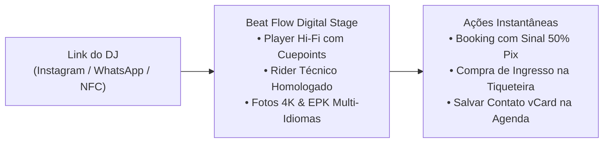
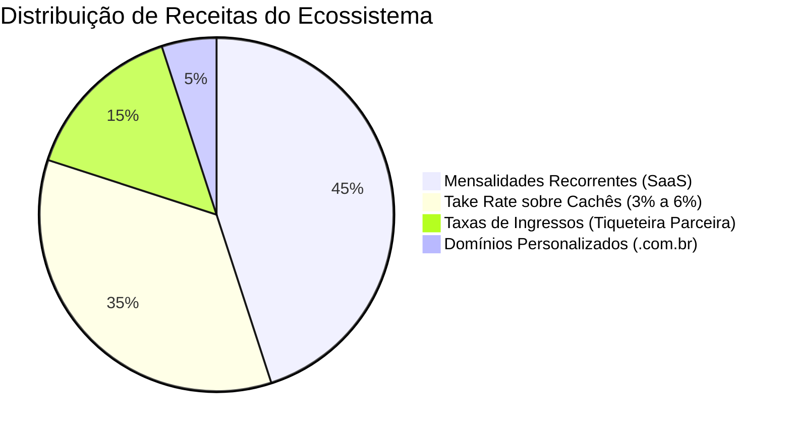

# BEAT FLOW by NEXORA — Documentação Completa do Produto

> **Status do Projeto:** Versão 2.0 (Produção / Comercializável)  
> **Autor & Propriedade:** NEXORA  
> **Classificação:** Documento Executivo, Comercial e de Engenharia  

---

## 1. Visão Comercial: Por que o Beat Flow? (Executive Pitch)

### 1.1. O Problema da Indústria da Música e Eventos
Atualmente, DJs e produtores musicais perdem cerca de **30% a 45% das oportunidades de contratação** por problemas fundamentais na apresentação comercial:

1. **PDFs Pesados e Inconvenientes (50MB+):** O DJ envia um arquivo PDF gigante por WhatsApp. O contratante (no celular, em 4G) demora para baixar, o PDF não toca música, não tem fotos em alta resolução acessíveis e desatualiza no dia seguinte.
2. **Links Genéricos e Amadores (Linktree, etc.):** Ferramentas genéricas de link na bio foram feitas para influenciadores, não para artistas. Elas não possuem player com cuepoints, não exibem mapas de palco/rider técnico, não calculam deslocamento e passam uma imagem de amadorismo.
3. **Atraso na Negociação e Perda de Sinal:** A negociação é feita no chat informal do WhatsApp sem estrutura. O contratante pede orçamento, o DJ demora horas para responder os termos técnicos e o evento fecha com outro artista.

---

### 1.2. A Solução: O Palco Digital Definitivo (Digital Stage & Smart EPK)
O **Beat Flow** transforma o link do artista no seu **Site Oficial Cinematográfico e Central de Contratação** em uma única URL (`beatflow.me/@nomedodj` ou domínio próprio `djnomedoartista.com.br`).



---

### 1.3. Por que o DJ Paga Todo Mês com Prazer?
* **Retorno sobre o Investimento Imediato:** Um único show fechado pelo Beat Flow (cachê de R$ 2.000 a R$ 15.000) paga **mais de 10 anos de assinatura** da plataforma.
* **Autoridade e Status:** O perfil possui estética de alta tecnologia (padrão Apple Pro e Resident Advisor), transmitindo a sensação de um artista internacional.
* **Ferramenta de Trabalho Real:** O DJ usa o Beat Flow no celular com **acesso biométrico**, **gravação de tags NFC** e **modo telão de LED (Stage Mode)** durante as próprias apresentações.

---

## 2. Escopo do Projeto & Arquitetura

O sistema é dividido em **4 grandes camadas integradas**:

```mermaid
graph TD
    subgraph 1. Experiência Pública
        P1["Palco Digital do DJ (/[slug])"]
        P2["Landing Page Interativa (/)"]
        P3["Hub de Exploração (/explorar)"]
    end

    subgraph 2. Área do Artista (PWA / Mobile)
        D1["Dashboard do DJ (/dashboard)"]
        D2["Gerenciador de Mídias e Rider"]
        D3["Gestão de Propostas e Agendas"]
        D4["Passe Digital NFC & vCard"]
    end

    subgraph 3. Núcleo Administrativo (Owner)
        A1["Painel Super Admin (/admin)"]
        A2["Emissor de Cortesias VIP 30 Dias"]
        A3["Gestão de Usuários & Moderação"]
    end

    subgraph 4. Infraestrutura Serverless & Custo Zero
        I1["Firebase Firestore & Auth"]
        I2["Web NFC API & WebAuthn"]
        I3["Fórmula Haversine de Logística"]
        I4["Integração Externa de Ingressos"]
    end
```

---

## 3. Catálogo Detalhado de Funcionalidades

### 3.1. Experiência do Palco Digital do Artista (`/[slug]`)

| Funcionalidade | Descrição Técnica & Operacional |
| :--- | :--- |
| **Atmosfera Volumétrica Personalizada** | 4 Universos visuais nativos (`NOIR & CHROME`, `SUNSET & ORGANIC`, `ICE & FUTURISTIC`, `RAW & INDUSTRIAL`) com partículas dinâmicas em Canvas, cores de acento e tipografia exclusiva. |
| **Navegação Espacial Desktop (Apple Style)** | Barra flutuante em vidro fosco (`backdrop-blur-2xl`) com tabs comutáveis (`Palco`, `EPK`, `Rider`, `Agenda`, `Booking`) e suporte a atalhos de teclado (`Espaço` = Play/Pause, `S` = Telão LED, `ESC` = Fechar modais). |
| **Card 3D Parallax Tilt** | Efeito de profundidade tridimensional que acompanha os movimentos do mouse do usuário na tela do computador. |
| **Hi-Fi Audio Deck com Cue Points** | Player integrado com marcadores rápidos de salto: `Intro` (0:45), `Build-up` (2:30), `Peak Drop` (4:15) e `Outro` (5:50), permitindo que o contratante ouça o ápice do show em 1 clique. |
| **EPK Multi-Idiomas** | Biografia oficial com seletor instantâneo de idioma (**Português, Inglês, Espanhol**) e botão de copiar texto formatado em 1 clique para releases de imprensa. |
| **Galeria de Fotos 4K com Lightbox** | Visualizador de fotos em altíssima resolução com zoom e botão de download individual ou pack para designers de flyers. |
| **Pack de Logos Vetorizados** | Download de logos oficiais em PNG e SVG com fundo transparente. |
| **Rider Técnico Homologado** | Detalhamento gráfico de equipamentos de cabine (Pioneer CDJ-3000, DJM-A9), lista estéreo de canais de áudio (Input List) e exigências de camarim/hospitalidade. |
| **Agenda de Shows com Sinergia de Ingressos** | Calendário de turnê em tempo real com botão oficial *"Garantir Ingresso / Lista VIP"* direcionando o tráfego para a sua plataforma principal de ingressos. |
| **Modo Telão LED (Stage Mode)** | Modo de tela cheia com visuais sincronizados com a batida para ser projetado em telões de LED de clubs e festivais. |

---

### 3.2. Tecnologias Nativas Mobile & Hardware (Custo Zero)

| Funcionalidade | Descrição Técnica |
| :--- | :--- |
| **Passe Digital NFC Instantâneo** | Permite que o celular do DJ transmita o seu perfil instantaneamente para outros smartphones via Web NFC API nativa do navegador. |
| **Gravador de Tags & Chaveiros** | Ferramenta integrada no app para gravar o link oficial do DJ em qualquer cartão ou chaveiro NFC comum. |
| **Gerador de vCard Inteligente** | Gera e salva automaticamente o cartão de visitas completo do artista (telefone, e-mail, foto e link) direto na agenda do contratante. |
| **Autenticação Biométrica Nativa** | Login com **Face ID, Touch ID e Biometria Android** via padrão WebAuthn (W3C), sem necessidade de digitação de senhas repetitivas. |
| **Mobile Floating Glass Pill** | Navegação mobile ergonômica na parte inferior da tela, sem barras de rolagem horizontais. |

---

### 3.3. Painel Administrativo do Proprietário (`/admin`)

| Funcionalidade | Descrição Técnica |
| :--- | :--- |
| **Proteção por Middleware Rígido** | Rota `/admin` blindada com checagem de privilégios de sessão (`superadmin`). Acessos não autorizados são bloqueados antes de atingir o servidor. |
| **Gerador de Cortesias VIP (Embaixadores)** | Ferramenta exclusiva para o Dono liberar acesso completo por **7, 15 ou 30 dias renováveis** a custo R$ 0,00, gerando mensagens prontas de convite formal para envio direto via WhatsApp. |
| **Monitor de Métricas & Usuários** | Visão centralizada de DJs cadastrados, status de assinatura e volume de propostas geradas. |

---

## 4. Requisitos do Sistema

### 4.1. Requisitos Funcionais (RF)
* **RF01:** O sistema deve carregar o perfil do DJ de forma pública e responsiva em menos de 1,5 segundos.
* **RF02:** O sistema deve permitir o envio de propostas formais de show com cálculo automático de 50% de sinal via PIX.
* **RF03:** O sistema deve possibilitar a gravação e leitura de dados de contato via NFC e QR Code dinâmico.
* **RF04:** O sistema deve sincronizar as datas de agenda e permitir o direcionamento externo para a tiqueteira oficial.
* **RF05:** O Super Admin deve ser capaz de criar, estender e revogar cortesias promocionais de 30 dias para qualquer usuário.

### 4.2. Requisitos Não-Funcionais (RNF)
* **RNF01 (Custo Operacional Zero de APIs):** Nenhuma funcionalidade essencial deve depender de APIs pagas de terceiros para distâncias, mensagens ou players.
* **RNF02 (Segurança & LGPD):** O banco de dados Firestore deve aplicar regras rigorosas de autorização (RBAC), impedindo que um usuário altere dados de terceiros ou eleve seus próprios privilégios.
* **RNF03 (Compatibilidade Multiplataforma):** A aplicação deve operar perfeitamente em navegadores Desktop modernos (Chrome, Safari, Edge, Firefox) e como PWA em iOS e Android.

---

## 5. Modelo Econômico e Estrutura de Receita



1. **Assinaturas SaaS Recorrentes:**
   * **Starter:** R$ 19,90/mês (volume e aquisição em massa).
   * **Pro Touring:** R$ 49,90/mês (EPK completo, Stage Mode e domínio).
   * **Black Agency:** R$ 129,90/mês (multi-artistas e suporte dedicado).
2. **Taxa de Intermediação de Cachê (Take Rate):** Split de 3% a 6% sobre os sinais e cachês de shows transacionados na plataforma.
3. **Sinergia com a Plataforma de Ingressos:** Todo o tráfego de fãs gerado pelos DJs nos eventos é canalizado diretamente para a sua tiqueteira oficial, aumentando a receita de bilheteria sem custo de anúncios.
